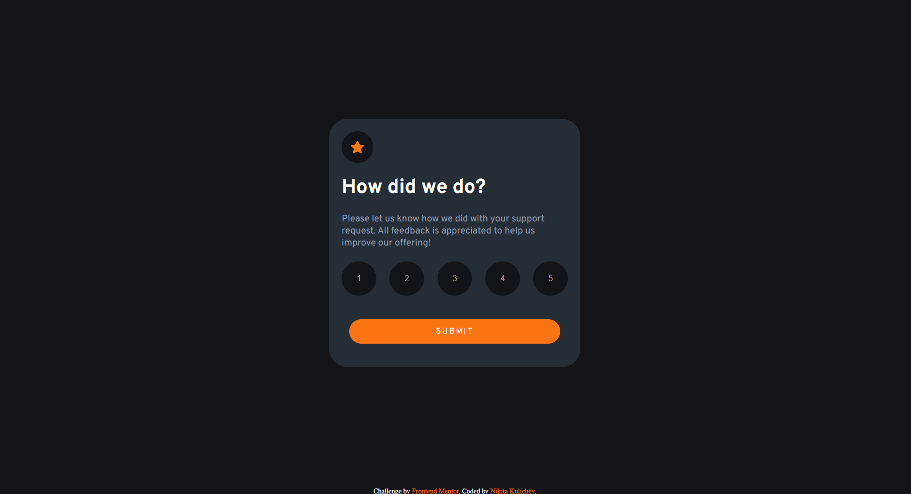

# Frontend Mentor - Interactive rating component solution

This is a solution to the [Interactive rating component challenge on Frontend Mentor](https://www.frontendmentor.io/challenges/interactive-rating-component-koxpeBUmI). Frontend Mentor challenges help you improve your coding skills by building realistic projects. 

## Table of contents

- [Overview](#overview)
  - [The challenge](#the-challenge)
  - [Screenshot](#screenshot)
  - [Links](#links)
- [My process](#my-process)
  - [Built with](#built-with)
  - [What I learned](#what-i-learned)
  - [Continued development](#continued-development)
  - [Useful resources](#useful-resources)
- [Author](#author)
- [Acknowledgments](#acknowledgments)

**Note: Delete this note and update the table of contents based on what sections you keep.**

## Overview

### The challenge

Users should be able to:

- View the optimal layout for the app depending on their device's screen size
- See hover states for all interactive elements on the page
- Select and submit a number rating
- See the "Thank you" card state after submitting a rating

### Screenshot

### Links

- Solution URL: [Add solution URL here](https://github.com/longrast/FrontendmentorChallenge-2)
- Live Site URL: [Add live site URL here](https://longrast.github.io/FrontendmentorChallenge-2/)

## My process

In the process of doing my work I have difficulties with event listeners. I would be very grateful if someone could show by an example of my work how to put event listeners for each button using array.forEach and addEventListener inside.

### Built with

- SCSS custom properties
- Flexbox
- Mobile-first workflow
- Basic JS

### Continued development

I'm still not comfortable with JS.

## Author

- Frontend Mentor - [@yourusername](https://www.frontendmentor.io/profile/longrast)